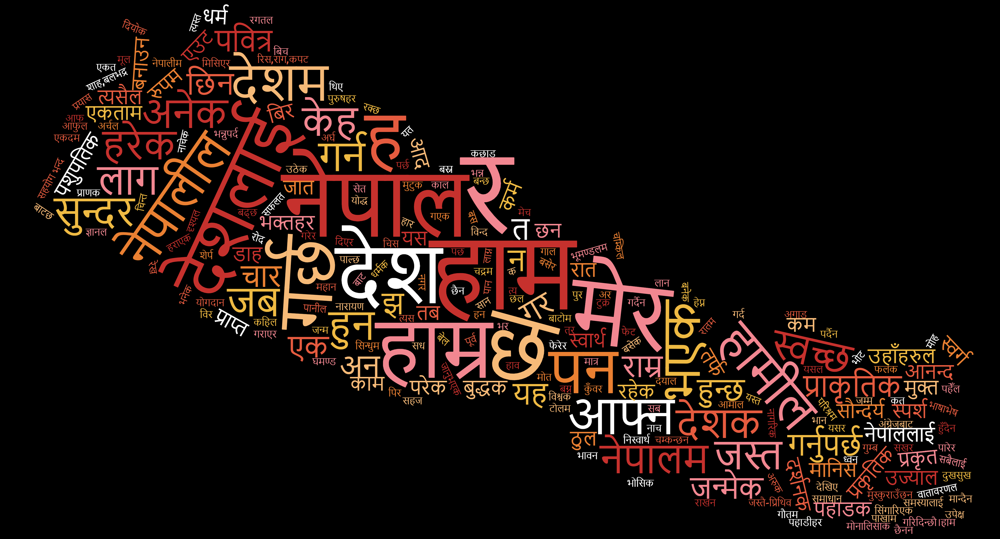

# Nepali Word2Vec from scratch




## Open in  : [◽◽Kaggle◽◽](https://www.kaggle.com/rajanghimire/nepali-word2vec)

## Download Datasets : 
## [◽◽RAW TEXT◽◽](https://www.kaggle.com/rajanghimire/nepdata)
## [◽◽STOPWORDS ◽◽](https://www.kaggle.com/rajanghimire/stopwords)

## Download [Pre Trained Model](https://www.kaggle.com/rajanghimire/nepali-word2vec) : 

## Load the pretrained model
```
from gensim.models import Word2Vec
model_W2V = Word2Vec.load("nepaliW2V_5Million.model")
```
##  Some outputs
```
model.wv.most_similar('ठमेल')
->
[('लेकसाइड', 0.7085685729980469),
 ('जमल', 0.7031379342079163),
 ('बानेश्वर', 0.6600849628448486),
 ('सामाखुसी', 0.6546829342842102),
 ('न्युरोड', 0.6507934927940369),
 ('गोंगबु', 0.6498370170593262),
 ('बागबजार', 0.6398636102676392),
 ('कलं', 0.6395446062088013),
 ('हाइसन्चो\n', 0.6294294595718384),
 ('घण्टाघर', 0.6282877922058105)]
```
```
model_W2V.wv.most_similar('मनोरन्जन')
->
[('मनोरञ्जन', 0.7557299733161926),
 ('मजा', 0.66391921043396),
 ('मज्जा', 0.6295955777168274),
 ('आम्तसन्तुष्टि', 0.6150055527687073),
 ('मनोरंजन', 0.584694504737854),
 ('विश्राम', 0.5715169310569763),
 ('प्रवज्या', 0.5609654188156128),
 ('सन्न्यास', 0.5532158613204956),
 ('नभन्नू', 0.5427237749099731),
 ('थाप्नेआशिर्वाद', 0.5276983380317688)]
```
```
model.wv.similarity('फेसबूक', 'इन्स्टाग्राम')
->
0.8016524
```
## Requirements 
```
gensim
snowballstemmer
```
